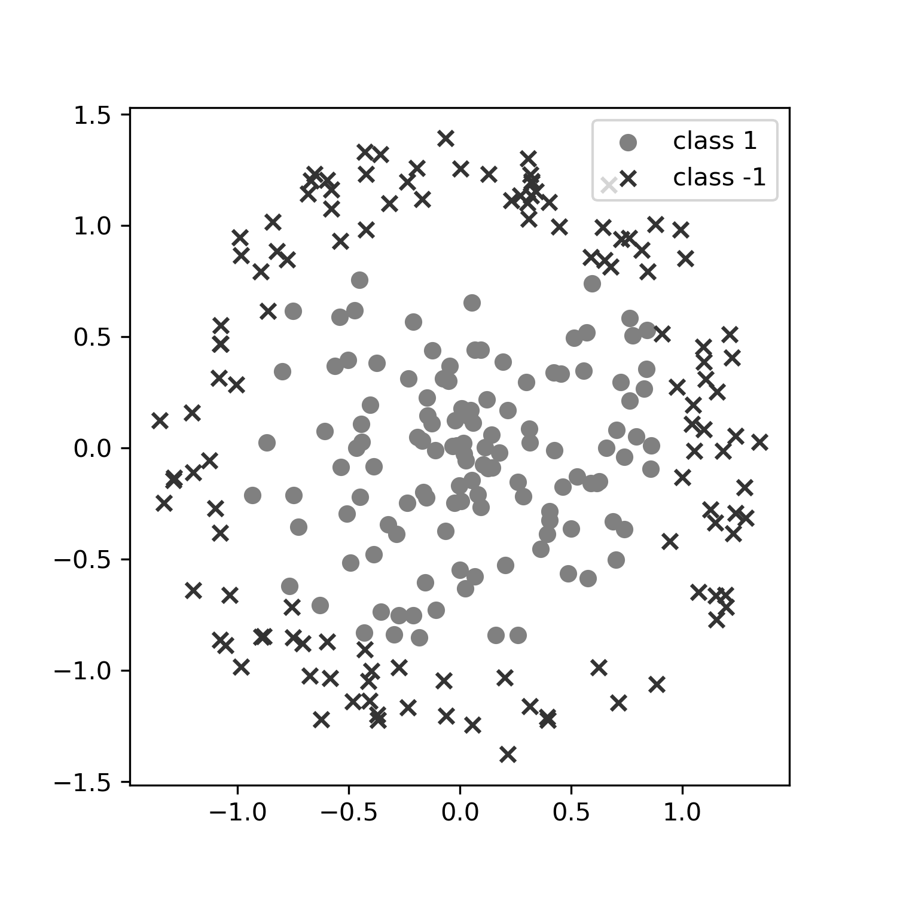
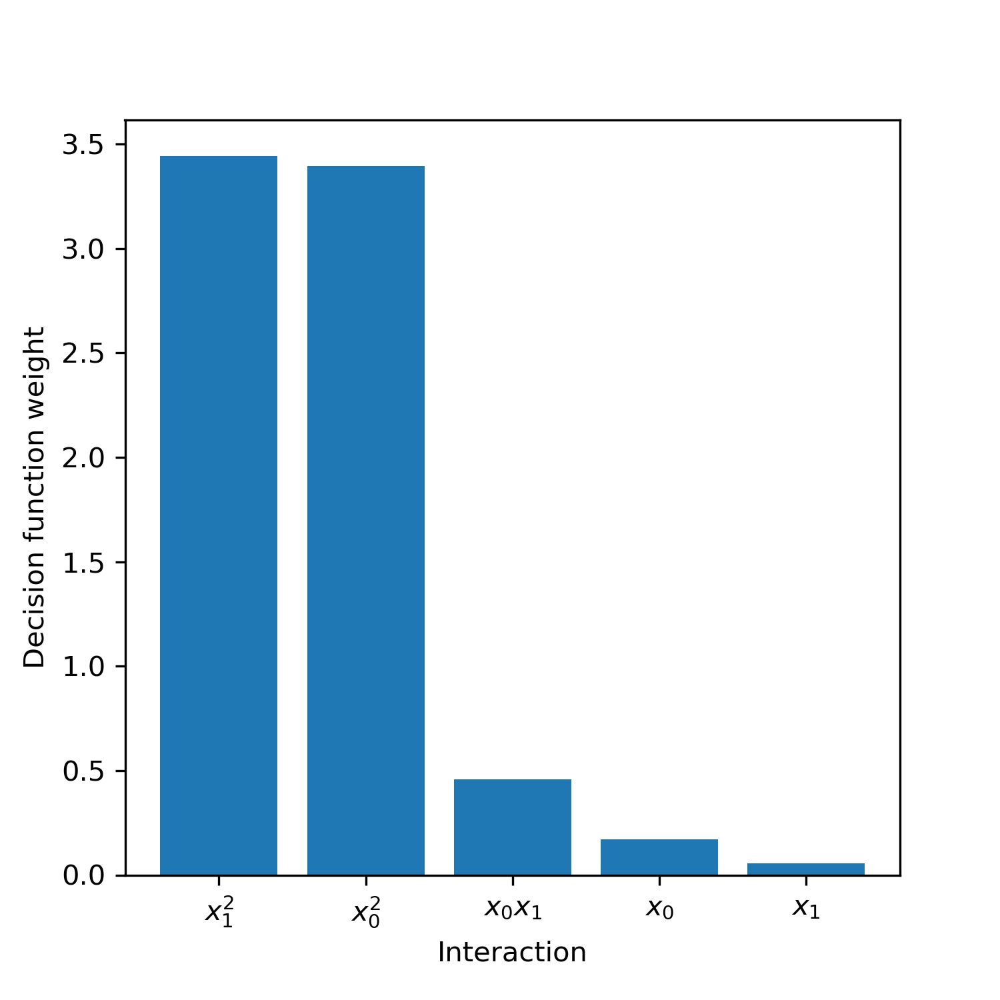
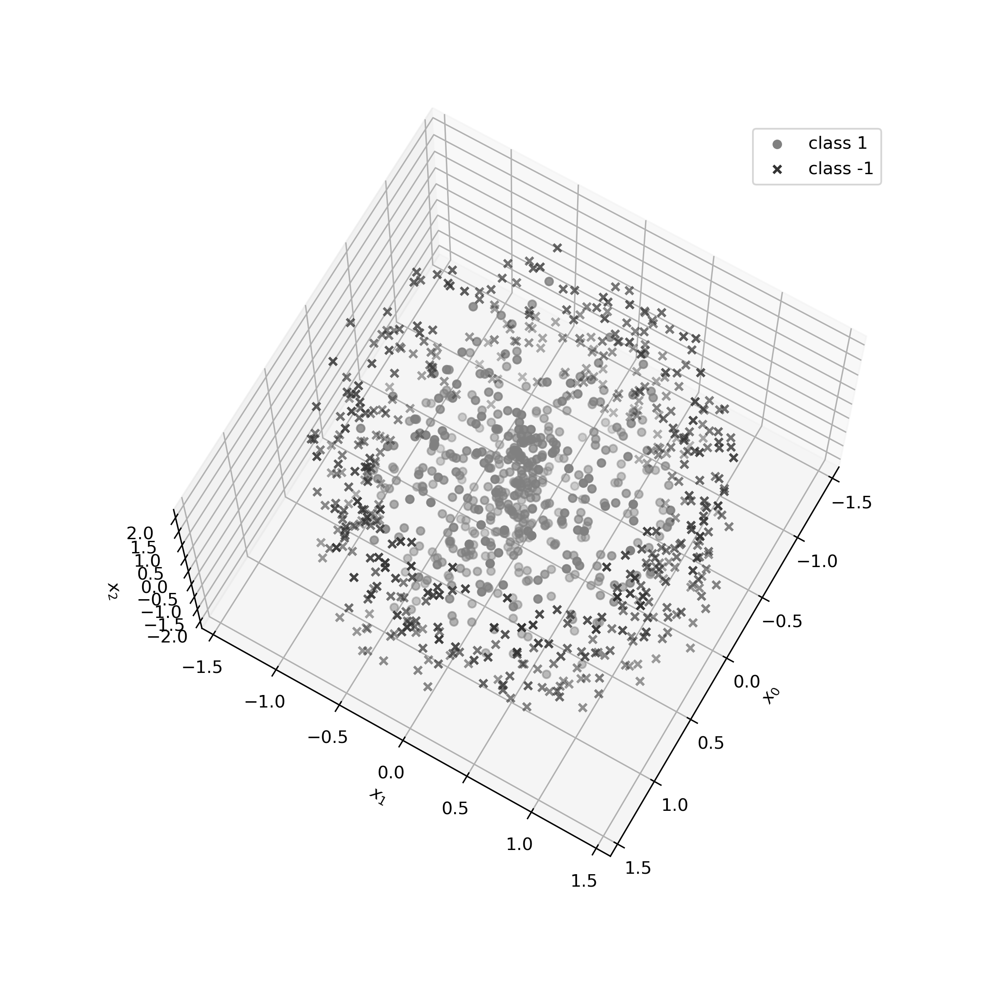
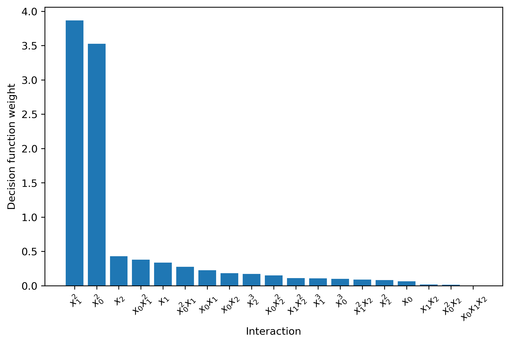

ExplainPolySVM
==============

Welcome to ExplainPolySVM, a python package for feature importance analysis and feature selection
for SVM models trained using the polynomial kernel

:math:`K_p(x,y|r,D,g)=(r+g(x^Ty))^D`,

on binary classification problems. Here :math:`x` and :math:`y` are column vectors and :math:`r`, :math:`g`,
and :math:`D` are the independent term, scale coefficient and the degree of the polynomial kernel, respectively.
The greek letter gamma is often used for :math:`g`.

To express feature importance, the trained SVM model is transformed into a compressed linear version of the polynomial transformation used in the polynomial kernel.

Where to get
------------

The source code is currently hosted on GitHub at: https://github.com/rikvinge/explainpolysvm

To install, clone the repository and install via pip while standing in the folder containing the explainpolysvm folder, using the command

.. code-block::

    pip install ./explainpolysvm

To contribute to the development, it is recommended to install the module in edit mode including the "dev" extras to get the correct
version of pytest.

.. code-block::

    pip install -e "./explainpolysvm[dev]"

Binary installers to be added later.

Usage
-----

**The ExPSVM module**

The main functionality is provided by the :code:`ExPSVM` module. It interacts closely with Scikit-learn's SVC support
vector machine but can also be instantiated manually. Using a pretrained Scikit-learn SVC model :code:`svc_model` as
starting-point, a transformed SVM model using :code:`ExPSVM` can be achieved by

.. code-block::

    import expsvm
    sv = svc_model.support_vectors_
    dual_coef = svc_model.dual_coef_
    intercept = svc_model.intercept_
    d = svc_model.degree
    r = svc_model.coef0
    gamma = svc_model.gamma_

    es = expsvm.ExPSVM(sv=sv, dual_coef=dual_coef, intercept=intercept, kernel_d=d, kernel_r=r, kernel_gamma=gamma)
    es.transform_svm()

Or, simply

.. code-block::

    import expsvm
    es = expsvm.ExPSVM(svc_model=svc_model, transform=True)

Feature importance is retrieved by

.. code-block::

    feat_importance, feat_names, sort_order = es.feature_importance()

where :code:`feat_importance`, :code:`feat_names`, and :code:`sort_order` are all Numpy ndarrays.
:code:`feat_importance` contains the importance ofeach feature. :code:`feat_names` contains names of the features,
detailes about which interaction the feature correspond to. :code:`sort_order` provides the ordering of the interactions
to reorder the interactions returned by es.get_interactions() to the same order as returned by es.feature_importance().
Feature names are returned as strings of the form :code:`i,j,k,l,...`, where :code:`i`, :code:`j`, :code:`k`, :code:`l`
are integers in the range :math:`[1,p]` where `p` is the number of features in the original space. For example, the
interaction '0,1,0,2,2' correspond to the interaction :math:`x0^2*x1*x2^2`.
Alternatively, setting the flag :code:`format_names=True` returns the feature names as formatted strings that are suitable for plotting. For
example, the interaction '0,1,0,2,2' is returned as 'x_{0}^{2}x_{1}x_{2}^{2}'.

To return formatted feature names, use

.. code-block::

    feat_importance, formatted_feat_names, sort_order = es.feature_importance(format_names=True)

Or, to format an existing feature name list

.. code-block::

    formatted_feat_names = es.format_interaction_names(unformatted_feat_names)

Feature selection can be applied based on the contributions to the decision function. Three selection rules are
currently implemented.

.. code-block::

    # Select the 10 most important features
    feature_selection = es.feature_selection(n_interactions = 10)

    # Select 60% of the features based on importance
    feature_selection = es.feature_selection(frac_interactions = 0.6)

    # Select features that sum to 99% of the sum of all feature importances
    feature_selection = es.feature_selection(frac_importance = 0.99)

**A word of caution**

Under the hood, ExPSVM calculates a compressed version of the full polynomial transformation of the polynomial kernel. Without compression, the number of interactions in this transformation is of order :math:`O(p^d)`, where :math:`p` is the number of features in the original space, and :math:`d` the polynomial degree of the kernel. The compression reduces the number of interactions by keeping only one copy of each unique interaction. Even so, it is not recommended to use too large :math:`p` or :math:`d`.

Example usage
-------------

In this toy example, a two-dimensional binary classification problem is generated such that the positive class lies
within the unit circle, and the negative class within the ring with minimum radius 1 and maximum radous 1.41. From each
class, 100 training samples are generated. An example dataset is visualized below.

An SVM with a quadratic kernel is trained using the manually set
hyperparameters :math:`C=0.9`, :math:`g='scale'` from Scikit-learn's SVC implementation, and :math:`r=2^0.5`.

The test performance on a 50-sample, balanced, test set is around 0.96.

The trained SVM feature importance is achieved using the following code

.. code-block::

    import numpy as np
    import matplotlib.pyplot as plt
    from sklearn.svm import SVC

    from explainpolysvm import expsvm

    # Fit SVM
    C = 0.9
    degree = 2
    gamma = 'scale'
    r = np.sqrt(2)

    # Fit SVM

    kernel = 'poly'
    model = SVC(C=C, kernel=kernel, degree=degree, gamma=gamma, coef0=r)
    model.fit(X_train, y_train)

    sv = model.support_vectors_
    dual_coef = np.squeeze(model.dual_coef_)
    intercept = model.intercept_[0]
    kernel_gamma = model._gamma

    # Extract feature importance
    es = expsvm.ExPSVM(sv=sv, dual_coef=dual_coef, intercept=intercept,
                    kernel_d=degree, kernel_r=r, kernel_gamma=kernel_gamma)
    es.transform_svm()

    feat_importance, feat_names, _ = es.feature_importance(format_names=True)

    # Plot
    fig, ax = plt.subplots(1,1, figsize=(5,5))
    ax.bar(x=np.arange(feat_importance.size), height=feat_importance, tick_label=['${}$'.format(name) for name in feat_names])
    plt.xlabel('Interaction')
    plt.ylabel('Decision function weight')
    plt.draw()

The resulting feature importance from a random sampling of the training set is

As we hoped for, the model learned to differentiate the two datasets through mainly the two interactions :math:`x0x0`
and :math:`x1x1`.

To investigate whether selecting only the top-2 interactions, i.e. :math:`x0x0`
and :math:`x1x1`, improves performance, the following code can be used.

.. code-block::

    # Performance without mask
    y_pred = np.sign(es.decision_function(x=X_test))
    acc = np.sum(y_pred==y_test)/y_test.size

    # Set mask containing only the top-2 interactions
    es.set_mask(n_interactions=2)

    # Performance with mask
    y_pred_masked = np.sign(es.decision_function(x=X_test,mask=True))
    acc_masked = np.sum(y_pred_masked==y_test)/y_test.size
	
In a second example, we expand the problem slightly by modifying the previous dataset in two ways:

- Add overlap between the classes by setting the inner circle radius to 1.05 and the outer ring's inner radius to 0.95.
- Add a third dimension. Both classes are sampled randomly within [-2,2].

Thus, the classes are sampled from a cylinder and a tube, respectively.
The classes are designed to be relatively well-separated in the radial direction in the first two dimensions, and the third dimension should be non-informative.
Below the dataset and the found feature importance are presented

	
Also in this simple example, the trained SVM has learned to mainly use the radial distance in the first two dimensions.

Further reading
---------------

For detailed information about the underlying theory of ExPSVM, please refer to |location_link|.

.. |location_link| raw:: html

   <a href="https://github.com/rikardvinge/explainpolysvm/blob/main/Polynomial_SVM_feature_importance_and_selection.pdf" target="_blank">Polynomial_SVM_feature_importance_and_selection.pdf</a>

A note on package maintenance
-----------------------------

So far, ExplainPolySVM is developed as a hobby project by a single author. No promises will be made on maintenance nor expansions of this package.
Feel free to fork, PR, and please let me know if you are interested in continuing it's development!

Future development
------------------

Below is a non-exhaustive list of useful and interesting features to add to the module.

- Add support for general polynomial kernels. In the current state, only the standard polynomial kernel is implemented; but any arbitrary polynomial kernel is expressable in the same way as the standard kernel. The only requirement this module have is that we can express any coefficients that are multiplied to the sum of the transformed support vectors and to keep track of the number of duplicates of the interactions.
- Add support for multi-class problems.
- Add support for the RBF Kernel by truncating the corresponding power series.
- Investigate if Least-square SVM, support vector regression, one-class SVM, etc. can be expressed in similar terms as done in this project for the standard SVM.

