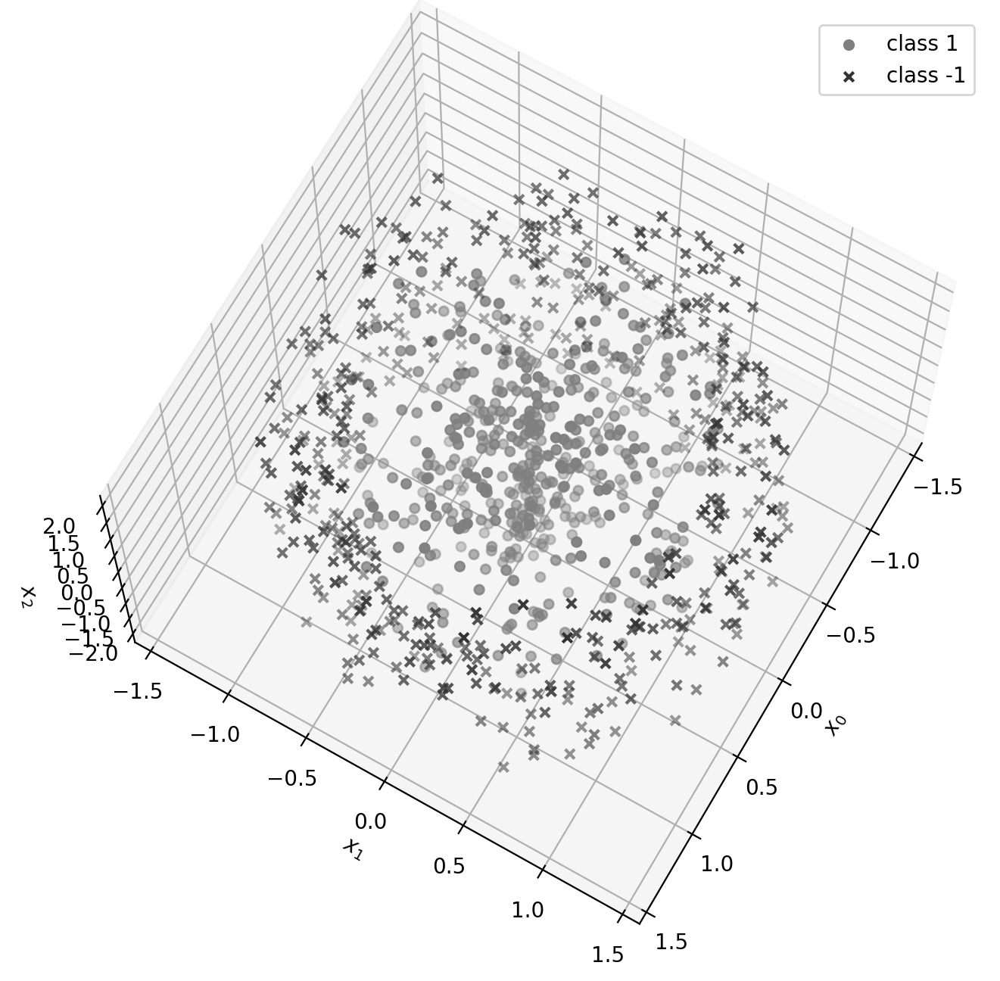
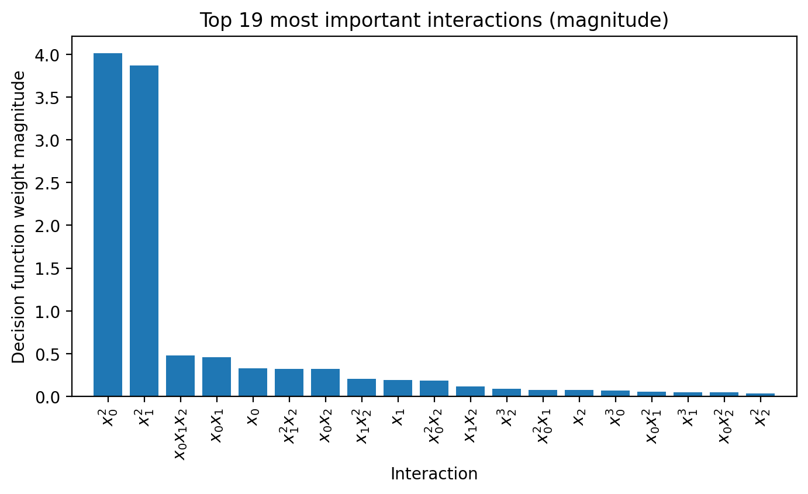
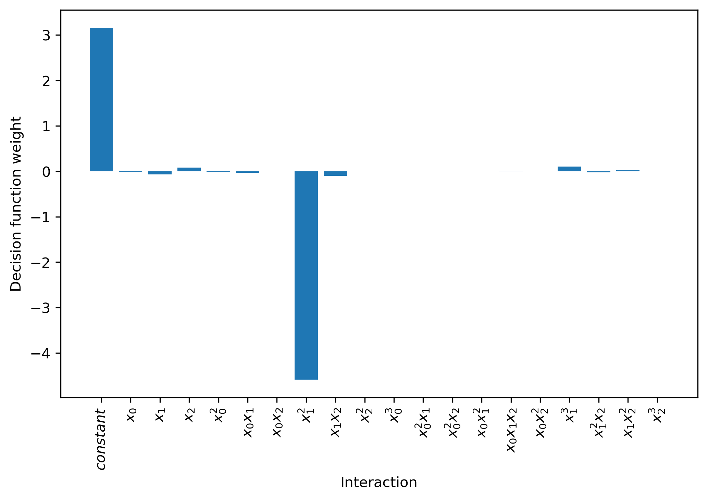
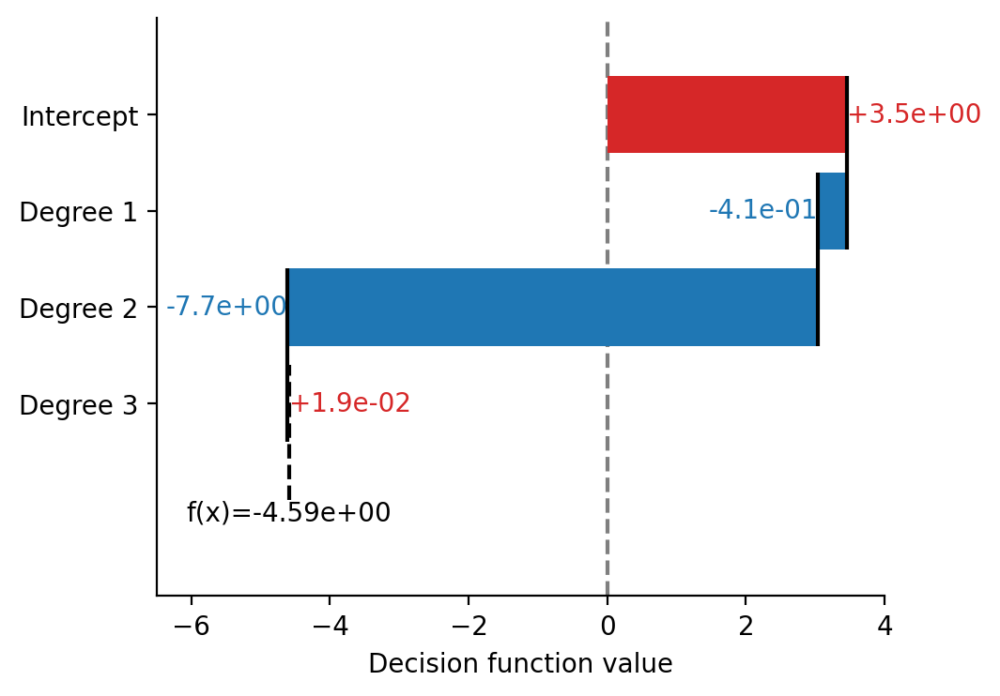
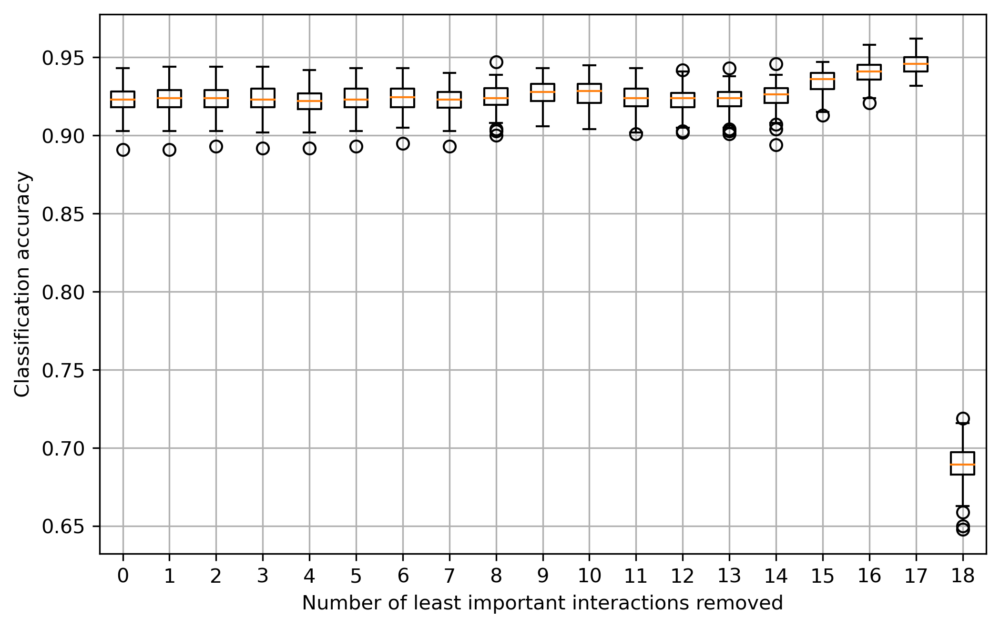

ExplainPolySVM
==============

Welcome to ExplainPolySVM, a python package for feature importance analysis and feature selection
for SVM models trained using the polynomial kernel

:math:`K_p(x,y|r,D,g)=(r+g(x^Ty))^D`,

on binary classification problems. Here :math:`x` and :math:`y` are column vectors and :math:`r`, :math:`g`,
and :math:`D` are the independent term, scale coefficient and the degree of the polynomial kernel, respectively.
The greek letter gamma is often used for :math:`g`.

To express feature importance, the trained SVM model is transformed into a compressed linear version of the polynomial transformation used in the polynomial kernel.

Where to get
============

The source code is currently hosted on GitHub at: https://github.com/rikardvinge/explainpolysvm

To install, clone the repository and install via pip while standing in the folder containing the explainpolysvm folder, using the command

.. code-block::

    pip install ./explainpolysvm

To contribute to the development, it is recommended to install the module in edit mode including the "dev" extras to get the correct
version of pytest.

.. code-block::

    pip install -e "./explainpolysvm[dev]"

Binary installers to be added later.

Usage
=====

**The ExPSVM module**

The main functionality is provided by the :code:`ExPSVM` module. It interacts closely with Scikit-learn's SVC support
vector machine but can also be instantiated manually. Using a pretrained Scikit-learn SVC model :code:`svc_model` as
starting-point, a transformed SVM model using :code:`ExPSVM` can be achieved by

.. code-block::

    import expsvm
    sv = svc_model.support_vectors_
    dual_coef = svc_model.dual_coef_
    intercept = svc_model.intercept_
    d = svc_model.degree
    r = svc_model.coef0
    gamma = svc_model.gamma_

    es = expsvm.ExPSVM(sv=sv, dual_coef=dual_coef, intercept=intercept, kernel_d=d, kernel_r=r, kernel_gamma=gamma)
    es.transform_svm()

Or, simply

.. code-block::

    import expsvm
    es = expsvm.ExPSVM(svc_model=svc_model, transform=True)

Feature importance is retrieved by

.. code-block::

    feat_importance, feat_names, sort_order = es.feature_importance()

where :code:`feat_importance`, :code:`feat_names`, and :code:`sort_order` are all Numpy ndarrays.
:code:`feat_importance` contains the importance of each feature. :code:`feat_names` contains names of the features,
details about which interaction the feature correspond to. :code:`sort_order` provides the ordering of the interactions
to reorder the interactions returned by es.get_interactions() to the same order as returned by es.feature_importance().
Feature names are returned as strings of the form :code:`i,j,k,l,...`, where :code:`i`, :code:`j`, :code:`k`, :code:`l`
are integers in the range :math:`[1,p]` where `p` is the number of features in the original space. For example, the
interaction '0,1,0,2,2' correspond to the interaction :math:`x_0^2*x_1*x_2^2`.
Alternatively, setting the flag :code:`format_names=True` returns the feature names as formatted strings that are suitable for plotting. For
example, the interaction '0,1,0,2,2' is returned as '$x_{0}^{2}$$x_{1}$$x_{2}^{2}$', or as a list of feature names if the
:code:`feature_names` argument is passed to the ExPSVM constructor.

To return formatted feature names, use

.. code-block::

    feat_importance, formatted_feat_names, sort_order = es.feature_importance(format_names=True)

Or, to format an existing feature name list

.. code-block::

    formatted_feat_names = es.format_interaction_names(unformatted_feat_names)

Feature selection can be applied based on the contributions to the decision function. Three selection rules are
currently implemented.

.. code-block::

    # Select the 10 most important features
    feature_selection = es.feature_selection(n_interactions = 10)

    # Select 60% of the features based on importance
    feature_selection = es.feature_selection(frac_interactions = 0.6)

    # Select features that sum to 99% of the sum of all feature importances
    feature_selection = es.feature_selection(frac_importance = 0.99)

**A word of caution**

Under the hood, ExPSVM calculates a compressed version of the full polynomial transformation of the polynomial kernel.
Without compression, the number of interactions in this transformation is of order :math:`O(p^d)`, where :math:`p` is
the number of features in the original space, and :math:`d` the polynomial degree of the kernel.
The compression reduces the number of interactions by keeping only one copy of each unique interaction, with a
compression ratio of :math:`d!:1`. Even so, it is not recommended to use too large :math:`p` or :math:`d`,
both because of potential memory issues but also due to the decreasing explainability in models with very large
kernel spaces.

Example usage
=============

Feature importance
------------------

In this toy example, a three-dimensional, binary classification problem is generated by randomly sample data from two axis-symmetric distributions.
The positive class is a solid tube of radius 1.05 and the negative class is a hollow tube of inner radius 0.95 and outer radius 1.41. The third, 
axis-symmetric, dimension is sampled uniformly in [-2, 2] for both classes.

The classes are designed to have a small overlap in the radial direction in the first two dimensions, and the third dimension should be non-informative.
Below the dataset is shown

The training set constitutes 200 samples from each of the two classes while the testset contains 300 from each class.

An SVM with a polynomial kernel is trained using Scikit-learn with parameters 
:math:`C=0.9`, :math:`d=3`, :math:`gamma=scale`, :math:`r=sqrt(2)`. With 3 features and a third-order polynomial
kernel, the number of interactions is 19, not counting the intercept.

The test performance on the 600-sample, balanced, test set is around 0.92.

To train the SVM and extract interaction importance the following code can be used

.. code-block::

    import numpy as np
    import matplotlib.pyplot as plt
    from sklearn.svm import SVC

    from explainpolysvm import expsvm

    # Fit SVM
    C = 0.9
    degree = 2
    gamma = 'scale'
    r = np.sqrt(2)

    # Fit SVM

    kernel = 'poly'
    model = SVC(C=C, kernel=kernel, degree=degree, gamma=gamma, coef0=r)
    model.fit(X_train, y_train)

    sv = model.support_vectors_
    dual_coef = np.squeeze(model.dual_coef_)
    intercept = model.intercept_[0]
    kernel_gamma = model._gamma

    # Extract feature importance
    es = expsvm.ExPSVM(sv=sv, dual_coef=dual_coef, intercept=intercept,
                    kernel_d=degree, kernel_r=r, kernel_gamma=kernel_gamma)
    es.transform_svm()

    # Plot
    es.plot_model_bar(n_features=19, magnitude=True, figsize=(8,4))

This produce the graph below.

The resulting weight for the coefficient in the decision function is greatly dominated by the sqaure of the two first features,
as we expect given the generating distributions of the data.

For local explanations, ExPSVM can produce waterfall graphs of the contribution to the decision function for each interaction.
Looking at a single observation, we can create such a graph using 

.. code-block::

    x = X_test[0,:]
    es.plot_sample_waterfall(x, n_features=19, show_values=True, show_sum=True)

In the example run the observation is of class -1 and has features [0.356, -1.352, 0.592]. With a radial
distance to the :math:`x_2`-axis of 1.398 it is well within the class -1 region.
The decision score for this observation is -4.6, correctly classifying it as belonging to class -1.
The contributions to the decision of this observation is presented in the figure below.

The absolute strongest contribution is from :math:`x_1^2`, a reasonable result given the strong weight on the
interaction :math:`x_1^2` as well on this observation's relatively large value in this feature.

We may also be interested in the importance of the degree of the interactions. To produce a waterfall chart the sums up
all contributions from each degree of interaction we can use

.. code-block::

    es.plot_sample_waterfall_degree(x, n_degree=3, show_values=True, show_sum=True)

For the chosen observation, the contribution from interaction degrees are

As expected, The second-order interactions heavily dominate the decision.

Feature selection
-----------------

In the feature selection example, we use the artificial 3d-tube case from above and step by step drop the interactions with lowest importance.
In total, there are 19 interactions in the compressed linear model for a problem with three features and a polynomial
degree of three.

The results are presented as a boxplot of 100 test sets, each containing 500 observations per class, while the number
of interactions is reduced in order of least importance. We find a small by gradual increase in median
classification accuracy, as well as a slight reduction in the standard deviation of the accuracy from 8.3e-3 to 7.1e-3. We also find that when dropping
the 18th feature, i.e. the second most important, performance drops to slightly above chance. This is due to dropping
of the two most important interactions, :math:`x_1^2`.

Further reading
===============

A manuscript with the details has been submitted for review.

A note on package maintenance
=============================

So far, ExplainPolySVM is developed by a single person. No promises will be made on maintenance nor expansions of this package.
Please let me know if you are interested in continuing its development and feel free to fork or PR!

Future development
==================

Below is a non-exhaustive list of useful and interesting features to add to the module.

- Add support for general polynomial kernels. In the current state, only the standard polynomial kernel is implemented; but any arbitrary polynomial kernel is expressible in the same way as the standard kernel. The only requirement this module have is that we can express any coefficients that are multiplied to the sum of the transformed support vectors and to keep track of the number of duplicates of the interactions.
- Add support for multi-class problems.
- Add support for the RBF Kernel by truncating the corresponding power series.
- Investigate if least-square SVM, support vector regression, one-class SVM, etc. can be expressed in similar terms as done in this project for the standard SVM.

Citations
=========

If you use ExplainPolySVM in your work we would appreciate a citation. A manuscript, authored together with J. Lundström
and S. Byttner at Halmstad University, has been submitted for review. In the meantime please cite according to the
CITATION.cff.

Acknowledgments
================

This work has been supported by Volvo Group.