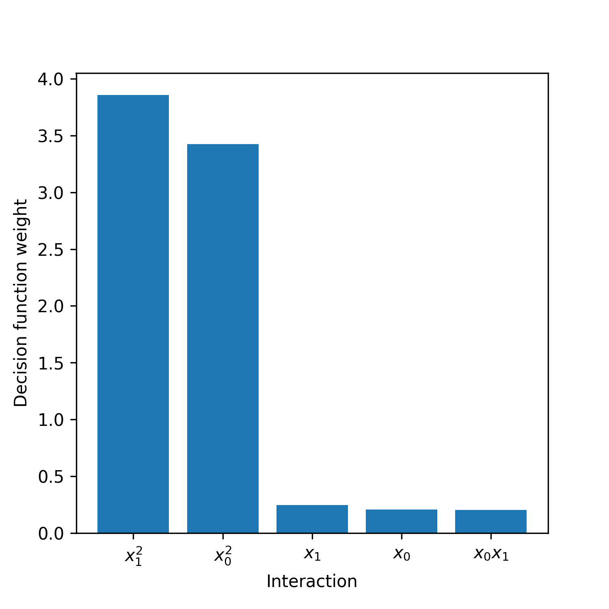

ExplainPolySVM
==============

Welcome to ExplainPolySVM, a python package for feature importance analysis and feature selection
for SVM models trained using the polynomial kernel

:math:`K_p(x,y|r,D,g)=(r+g(x^Ty))^D`,

on a binary classification problem. Here :math:`x` and :math:`y` are column vectors and :math:`r`, :math:`g`,
and :math:`D` are the independent term, scale coefficient and the degree of the polynomial kernel, respectively.
The greek letter gamma is often used for :math:`g`.

To express feature importance, the trained SVM model Is transformed into a compressed linear model.

Usage
------------------

**The ExPSVM module**

The main functionality is provided by the :code:`ExPSVM` module. It interacts closely with Scikit-learn's SVC support
vector machine but can also be instantiated manually. Using a pretrained Scikit-learn SVC model :code:`svc_model` as
starting-point, a transformed SVM model using :code:`ExPSVM` can be achieved by

.. code-block::

    import expsvm
    sv = svc_model.support_vectors_
    dual_coef = svc_model.dual_coef_
    intercept = svc_model.intercept_
    d = svc_model.degree
    r = svc_model.coef0
    gamma = svc_model.gamma_

    es = expsvm.ExPSVM(sv=sv, dual_coef=dual_coef, intercept=intercept, kernel_d=d, kernel_r=r, kernel_gamma=gamma)
    es.transform_svm()

Or, simply

.. code-block::

    import expsvm
    es = expsvm.ExPSVM(svc_model=svc_model, transform=True)

Feature importance is retrieved by

.. code-block::

    feat_importance, feat_names = es.feature_importance()

where :code:`feat_importance` and :code:`feat_names` are both Numpy ndarrays; the former containing the importance of
each feature and the latter contains names of the features, detailes about which interaction the feature correspond to.
Feature names are returned as strings of the form :code:`i,j,k,l,...`, where :code:`i`, :code:`j`, :code:`k`, :code:`l`
are integers in the range :math:`[1,p]` where `p` is the number of features in the original space. For example, the
interaction '0,1,0,2,2' correspond to the interaction :math:`x0^2*x1*x2^2'.

Features can be selected based on their contributions to the decision function. Three selection rules are provided.

.. code-block::

    # Select the 1 most important features
    feature_selection = es.feature_selection(n_interactions = 10)

    # Select 60% of the features based on importance
    feature_selection = es.feature_selection(frac_interactions = 0.6)

    # Select features that sum to 99% of the sum of all feature importances
    feature_selection = es.feature_selection(frac_importance = 0.99)

Example usage
-------------

In this toy example, a two-dimensional binary classification problem is generated such that the positive class lies
within the unit circle, and the negative class within the ring with minimum radius 1 and maximum radous 1.41. From each
class, 100 training samples are generated. An example dataset is visualized here

An SVM with a quadratic kernel is trained using the manually set
hyperparameters :math:`C=0.9`, :math:`g='scale'` from Scikit-learn's SVC implementation, and :math:`r=2^0.5`.

The test performance on a 50-sample, balanced, test set is around 0.96-1.

The trained SVM feature importance is achieved using the following code

.. code-block::

    # Fit SVM
    C = 0.9
    degree = 2
    gamma = 'scale'
    r = np.sqrt(2)

    # Fit SVM
    kernel = 'poly'
    model = SVC(C=C, kernel=kernel, degree=degree, gamma=gamma, coef0=r)
    model.fit(X_train, y_train)

    sv = model.support_vectors_
    dual_coef = np.squeeze(model.dual_coef_)
    intercept = model.intercept_[0]
    kernel_gamma = model._gamma

    es = expsvm.ExPSVM(sv=sv, dual_coef=dual_coef, intercept=intercept,
                    kernel_d=degree, kernel_r=r, kernel_gamma=kernel_gamma)
    es.transform_svm()

    feat_importance, feat_names, sort_order = es.feature_importance(format_names=True)

The resulting feature importance from a random sampling of the training set is

As we hoped for, the model learned to differentiate the two datasets through mainly the two interactions :math:`x0x0`
and :math:`x1x1`.

